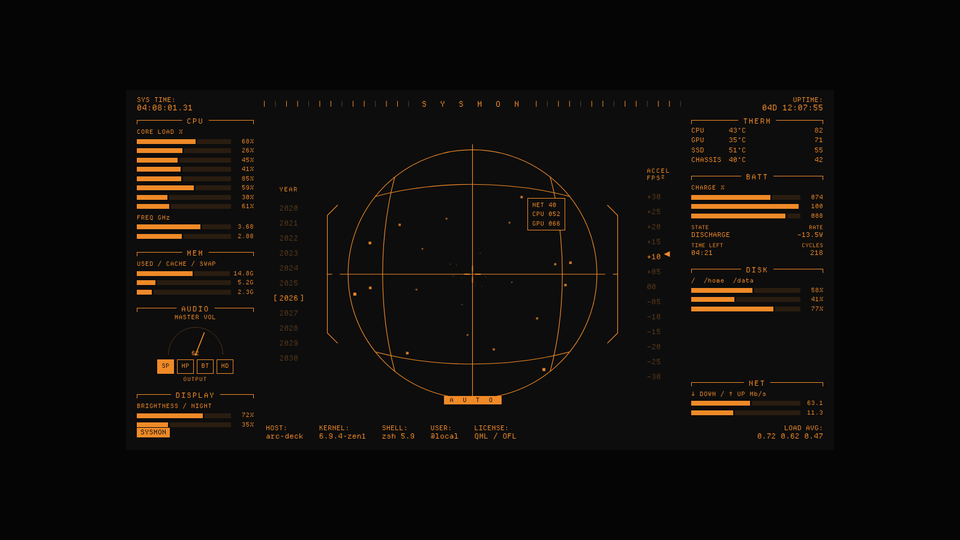

# Departure HUD

A retro-terminal SysMon HUD in the Departure Mono pixel font: per-core CPU,
memory, thermals, battery, disks, network, brightness, audio, and a
wireframe-sphere scope.

A self-contained **Qt 6 / QML** application. No Quickshell, no Noctalia,
no bash launcher — just a single binary. On wlroots-based compositors it
behaves like a desktop widget (anchored layer-shell surface, click-through
around the HUD). On everything else it degrades to a normal frameless
transparent window.



---

## Table of contents

1. [Build dependencies](#build-dependencies)
2. [Runtime dependencies](#runtime-dependencies)
3. [Build](#build)
4. [Install](#install)
5. [Run](#run)
6. [Configuration](#configuration)
7. [GPU info script](#gpu-info-script)
8. [Wayland behaviour](#wayland-behaviour)
9. [Autostart](#autostart)
10. [Troubleshooting](#troubleshooting)
11. [Files](#files)
12. [License](#license)

---

## Build dependencies

| Package | Why |
| --- | --- |
| `cmake` ≥ 3.21        | build system |
| `ninja`               | recommended generator |
| C++17 compiler (`g++`, `clang++`) | the code is plain C++17 |
| `qt6-base` dev        | Qt 6 Core / Gui |
| `qt6-declarative` dev | Qt 6 Qml / Quick |
| `qt6-wayland` dev     | Wayland QPA plugin and Qt Wayland helpers |
| `layer-shell-qt` dev *(optional)* | enables proper desktop-widget behaviour (`wlr-layer-shell`) on wlroots compositors and KDE Plasma 6 |

If `layer-shell-qt` isn't installed, CMake just disables that code path —
no error. You can also force-disable it: `-DENABLE_LAYER_SHELL=OFF`.

Qt **6.5 or newer** is required (`qt_add_qml_module` + `loadFromModule`).

### Per-distro

#### Arch / Manjaro / EndeavourOS
```sh
sudo pacman -S --needed cmake ninja qt6-base qt6-declarative qt6-wayland \
                        layer-shell-qt
```

#### Debian / Ubuntu (24.04+)
```sh
sudo apt install build-essential cmake ninja-build \
                 qt6-base-dev qt6-declarative-dev qt6-wayland-dev \
                 liblayershellqtinterface-dev    # optional
```

#### Fedora
```sh
sudo dnf install cmake ninja-build gcc-c++ \
                 qt6-qtbase-devel qt6-qtdeclarative-devel qt6-qtwayland-devel \
                 layer-shell-qt-devel    # optional
```

#### NixOS / nix-shell
```sh
nix-shell -p cmake ninja qt6.qtbase qt6.qtdeclarative qt6.qtwayland \
             layer-shell-qt
```

---

## Runtime dependencies

On the **target** machine you need only:

- Qt 6 runtime libraries: `qt6-base`, `qt6-declarative`, `qt6-wayland` (or
  the equivalent runtime packages for your distro — no `-dev`/`-devel`
  needed)
- `layer-shell-qt` runtime — only if the binary was built with it
- A Wayland compositor *(or X11 — the frameless-window fallback works too)*

These are **optional** and detected at runtime — the HUD just hides the
panel if they're missing:

- **AUDIO panel** — needs `wpctl` (from `wireplumber`) **or** `pactl`
  (from `pulseaudio-utils` / `libpulse`). Most modern desktops already
  have one.
- **GPU panel** — needs an executable at `gpuScriptPath` printing the
  documented JSON (see [GPU info script](#gpu-info-script)).
  Typically driven by `nvidia-smi`, `amdgpu_top`, `radeontop`, or
  `intel_gpu_top` — install whichever fits your hardware. The HUD
  itself stays vendor-agnostic.
- **BRIGHTNESS panel** — backlight devices under `/sys/class/backlight/*`.
  Provided by the kernel; if your laptop's backlight isn't exposed
  there, the panel hides.
- **BATTERY panel** — `/sys/class/power_supply/BAT*` (also kernel-
  provided). On a desktop without a battery, the panel hides.
- **THERM panel** — `/sys/class/hwmon/*`. On most distros nothing extra
  is needed; on a few you may want to load drivers (`lm_sensors`,
  `nct6775`, `coretemp`…) for richer readings.

Optional but handy for setting `"screen"` in the config: `wlr-randr`
(wlroots) or `hyprctl monitors` (Hyprland) to list output names.

Everything else (`/proc`, `/proc/net/dev`, `statvfs(3)`) is in the
kernel/libc — no extra packages.

The QML files and the Departure Mono font are embedded into the binary
via Qt's resource system, so you don't have to ship them separately.

---

## Build

```sh
git clone https://github.com/UmedjonBA/Departure-hud.git
cd Departure-hud

cmake -B build -G Ninja -DCMAKE_BUILD_TYPE=Release
cmake --build build
```

Resulting binary: `build/departure-hud` (about 2 MB).

CMake options:

| Option | Default | Effect |
| --- | --- | --- |
| `-DCMAKE_BUILD_TYPE=Release` | (none) | enable optimisations |
| `-DENABLE_LAYER_SHELL=ON\|OFF` | `ON` | look for LayerShellQt; with `OFF` the binary always uses the frameless-window fallback |
| `-DCMAKE_INSTALL_PREFIX=/usr` | `/usr/local` | install location |

---

## Install

System-wide:
```sh
sudo cmake --install build
# → /usr/local/bin/departure-hud
# → /usr/local/share/departure-hud/config.json
```

Or just symlink the built binary into your `$PATH`:
```sh
ln -s "$PWD/build/departure-hud" ~/.local/bin/departure-hud
```

Or run it from the build directory directly — no install required.

---

## Run

```sh
departure-hud                          # use the default config search
departure-hud -c /path/to/config.json  # explicit config
departure-hud --install-config         # copy built-in defaults to $XDG_CONFIG_HOME
departure-hud --print-config           # print active config path and exit
departure-hud --help                   # show CLI options
```

Close with `Ctrl+C` in the terminal, or `pkill departure-hud`. To detach
from the shell:
```sh
departure-hud & disown
```

---

## Configuration

The HUD reads its settings from a JSON file. The first source that exists
wins; everything else falls back to compiled-in defaults.

**Search order:**

1. `--config PATH` / `-c PATH` on the command line
2. `$DEPARTURE_HUD_CONFIG` environment variable
3. `$XDG_CONFIG_HOME/departure-hud/config.json` — i.e.
   `~/.config/departure-hud/config.json`
4. Built-in defaults (no file)

You only need to set the keys you want to change. Missing keys fall back
to defaults — there is no "you must set everything" requirement. JSON
doesn't support comments; the `//` lines below are documentation only.

### Full reference

```jsonc
{
  // ─── Appearance ─────────────────────────────────────────────────
  "scale":          1.0,         // (float) multiplier for the base 1180×600 layout.
                                 //         0.5 = half-size, 2.0 = double, etc.

  "useBackground":  false,       // (bool) false → transparent backdrop (wallpaper shows through).
                                 //        true  → paint bgColor behind the HUD.

  "accentColor":    "#f08a28",   // (string "#rrggbb") main UI color: text, bars, frames.
  "hotColor":       "#ff5a3c",   // (string "#rrggbb") alert color: thresholds, low battery.
  "bgColor":        "#0d0d0d",   // (string "#rrggbb") background fill, only used if useBackground=true.

  // ─── Data sources ───────────────────────────────────────────────
  "updateMs":       1000,        // (int) polling interval, ms.
                                 //       200  = very smooth, hits /proc 5×/s
                                 //       2000 = relaxed, easier on the battery

  "disksToShow":    "/,/home",   // (string, comma-separated) mount points for the DISK panel.
                                 //       e.g. "/,/home,/mnt/data"
                                 //       Each must be a real mount point or it's silently skipped.

  "netInterface":   "",          // (string) pin a NIC by name ("eth0", "wlp3s0", "wg0"…).
                                 //          empty  → use netMode below.

  "netMode":        "sum",       // (string) only used when netInterface is empty:
                                 //   "sum"  → add traffic across all non-loopback interfaces
                                 //   "auto" → display the interface that is busiest right now
                                 //   (Anything else falls back to "auto"-style behaviour.)

  // ─── Thermal alert thresholds (°C) ──────────────────────────────
  // Values above 95% of these glow in hotColor on the THERM panel.
  "cpuMaxTemp":     90,          // (int, °C) CPU
  "gpuMaxTemp":     85,          // (int, °C) GPU
  "ssdMaxTemp":     65,          // (int, °C) NVMe / SSD

  // ─── Center scope ───────────────────────────────────────────────
  "showScope":      true,        // (bool)  false → hide the wireframe-sphere panel entirely.
  "starCount":      30,          // (int)   warp-speed star count, 0 disables the effect.

  // ─── Optional GPU info script ───────────────────────────────────
  // Path to an executable that prints a single line of JSON like:
  //   {"text":"50°C","tooltip":"Temperature: 50°C\nUtilization: 39%\nPower Usage: 6.24/[N/A] W\nClock Speed: 375/2100 MHz"}
  // If the path doesn't exist or isn't executable, the GPU panel hides.
  // ~ at the start is expanded to $HOME.
  "gpuScriptPath":  "~/.local/bin/gpuinfo.sh",

  // ─── Wayland surface placement (only honoured with layer-shell) ─
  "screen":         "",          // (string) "" = primary screen.
                                 //          Otherwise an output name: "DP-1", "eDP-1", "HDMI-A-1"…
                                 //          Get yours from `wlr-randr` or `hyprctl monitors`.

  "layer":          "bottom",    // (string) layer-shell namespace:
                                 //   "background" → below the wallpaper handler
                                 //   "bottom"     → above wallpaper, below normal windows (default — desktop widget)
                                 //   "top"        → above normal windows, below overlays/notifications
                                 //   "overlay"    → above everything (notifications, lockscreens)

  "clickThrough":   true,        // (bool)  true → area around the HUD is click-through, only HUD pixels
                                 //                receive input. Implemented via QWindow::setMask().
                                 //         false → whole layer surface intercepts input.
                                 //                Combine with keyboardFocus=ondemand to make it interactive.

  "keyboardFocus":  "none"       // (string) keyboard interactivity for the layer surface:
                                 //   "none"      → never receives keyboard input (default)
                                 //   "ondemand"  → grabs focus when clicked
                                 //   "exclusive" → grabs focus exclusively (only use if you know why)
}
```

### Where each key matters

- **Without layer-shell** (`layer-shell-qt` not installed, or
  `-DENABLE_LAYER_SHELL=OFF`): `layer`, `keyboardFocus`, `clickThrough`
  and `screen` only partially apply — the HUD is a regular frameless
  transparent window. `clickThrough` still works (it's a `QWindow` mask).
  Stacking and exact screen pinning are up to your compositor's window
  rules.

- **With layer-shell**: every key in the *Wayland surface placement*
  block is honoured.

### Example configs

**Fully transparent, scaled up 1.4×, all alerts on a cold AMD box:**
```json
{
  "scale": 1.4,
  "useBackground": false,
  "accentColor": "#86c8d4",
  "hotColor":    "#e06c75",
  "cpuMaxTemp": 75,
  "gpuMaxTemp": 70,
  "showScope": false
}
```

**Pinned to a second monitor, opaque, always on top:**
```json
{
  "screen": "HDMI-A-1",
  "useBackground": true,
  "bgColor": "#000000",
  "layer": "overlay",
  "clickThrough": false,
  "keyboardFocus": "ondemand"
}
```

**Quiet mode (slower polling, single disk, no warp stars):**
```json
{
  "updateMs": 2500,
  "disksToShow": "/",
  "starCount": 0,
  "netMode": "auto"
}
```

### Bootstrapping the config

The repo ships a sample `config.json`. To install it into the standard
location:
```sh
departure-hud --install-config
# → ~/.config/departure-hud/config.json
```
(It refuses to overwrite an existing file.)

---

## GPU info script

The GPU panel is opt-in: the HUD reads it from an external script that
the user provides. This keeps the binary vendor-agnostic — NVIDIA, AMD,
Intel and hybrid setups can all be fed in the same way.

**Contract:** the script prints **one line of JSON** to stdout and
exits. The shape:

```json
{
  "text":    "50°C",
  "tooltip": "Temperature: 50°C\nUtilization: 39%\nPower Usage: 6.24/[N/A] W\nClock Speed: 375/2100 MHz"
}
```

The HUD parses `tooltip` with regexes — it looks for `Temperature:`,
`Utilization:`, `Power Usage:` and `Clock Speed: X / Y MHz`. Missing
fields just hide their row; you don't need to provide all of them. If
`tooltip` lacks a temperature, `text` is parsed as a fallback (any
number followed by `°C`).

Point `gpuScriptPath` at the executable. `~` expands to `$HOME`.

### Example: NVIDIA (`nvidia-smi`)

```sh
#!/usr/bin/env bash
# ~/.local/bin/gpuinfo.sh — NVIDIA via nvidia-smi
read TEMP UTIL POW POW_MAX CLK CLK_MAX < <(
  nvidia-smi --query-gpu=temperature.gpu,utilization.gpu,power.draw,power.max_limit,clocks.gr,clocks.max.gr \
             --format=csv,noheader,nounits | tr ',' ' '
)
printf '{"text":"%s°C","tooltip":"Temperature: %s°C\\nUtilization: %s%%\\nPower Usage: %s/%s W\\nClock Speed: %s/%s MHz"}\n' \
       "$TEMP" "$TEMP" "$UTIL" "$POW" "$POW_MAX" "$CLK" "$CLK_MAX"
```
```sh
chmod +x ~/.local/bin/gpuinfo.sh
```

### Example: AMD (`amdgpu_top`)

```sh
#!/usr/bin/env bash
# ~/.local/bin/gpuinfo.sh — AMD via amdgpu_top (pacman -S amdgpu_top)
J=$(amdgpu_top -d -J -n 1 -s 50 2>/dev/null | jq '.devices[0]')
TEMP=$(jq -r '.Sensors."Edge Temperature".value // 0'   <<<"$J")
UTIL=$(jq -r '.gpu_activity.GFX.value // 0'             <<<"$J")
POW=$( jq -r '.Sensors."Average Power".value // 0'      <<<"$J")
CLK=$( jq -r '.gpu_clock.value // 0'                    <<<"$J")
CLK_MAX=$(jq -r '.gpu_clock.max // 0'                   <<<"$J")
printf '{"text":"%s°C","tooltip":"Temperature: %s°C\\nUtilization: %s%%\\nPower Usage: %s/[N/A] W\\nClock Speed: %s/%s MHz"}\n' \
       "$TEMP" "$TEMP" "$UTIL" "$POW" "$CLK" "$CLK_MAX"
```

### Example: Intel (`intel_gpu_top`)

`intel_gpu_top -J -s 1000` emits a stream of JSON snapshots. Capture
one frame and reshape it; integrated GPUs don't usually expose
power/clock, so omit those fields and the HUD hides the corresponding
rows.

### Minimal placeholder (temperature only)

```sh
#!/usr/bin/env bash
T=$(sensors | awk '/^edge:/ {gsub(/[+°C]/,"",$2); print int($2); exit}')
[ -n "$T" ] && printf '{"text":"%s°C","tooltip":"Temperature: %s°C\\n"}\n' "$T" "$T"
```

If the script is missing, non-executable, returns empty, or prints
invalid JSON — the GPU panel just hides. No errors.

---

## Wayland behaviour

| Build option           | Behaviour |
| ---------------------- | --------- |
| `layer-shell-qt` **available** at build time | HUD is anchored to all four screen edges as a layer-shell surface; `layer`, `clickThrough`, `keyboardFocus`, `screen` from the config are honoured. This is the original "sits above the wallpaper, below your apps" behaviour. |
| **not available**      | Regular frameless transparent Qt window. The compositor decides stacking; `layer` is ignored. `clickThrough` still works via input mask. |

On X11 sessions, the frameless-window fallback is used regardless.

GNOME/Mutter does **not** implement `wlr-layer-shell`, so even with the
optional package the HUD falls back to a floating window there. Use a
wlroots compositor (Sway, Hyprland, river, Wayfire, …), KDE Plasma 6,
labwc, niri, etc. for the full experience.

---

## Autostart

### Hyprland
```conf
# ~/.config/hypr/hyprland.conf
exec-once = /home/USER/.local/bin/departure-hud
```

### Sway
```conf
# ~/.config/sway/config
exec /home/USER/.local/bin/departure-hud
```

### Niri
```kdl
# ~/.config/niri/config.kdl
spawn-at-startup "/home/USER/.local/bin/departure-hud"
```

### XDG autostart (generic)
`~/.config/autostart/departure-hud.desktop`:
```ini
[Desktop Entry]
Type=Application
Name=Departure HUD
Exec=/home/USER/.local/bin/departure-hud
X-GNOME-Autostart-enabled=true
```

### systemd user service
`~/.config/systemd/user/departure-hud.service`:
```ini
[Unit]
Description=Departure HUD
PartOf=graphical-session.target
After=graphical-session.target

[Service]
ExecStart=%h/.local/bin/departure-hud
Restart=on-failure

[Install]
WantedBy=graphical-session.target
```
```sh
systemctl --user daemon-reload
systemctl --user enable --now departure-hud
```

---

## Troubleshooting

**Nothing appears, no errors in the terminal.**
Run with Qt verbose category logging:
```sh
QT_LOGGING_RULES='*.debug=true' departure-hud
```
On compositors with strict output protection, set `"screen"` explicitly
(use `wlr-randr` or `hyprctl monitors` to find the output name).

**The HUD opens on top of all windows when I want it below.**
You're either built without `layer-shell-qt`, or your compositor doesn't
support `wlr-layer-shell` (e.g. GNOME). Confirm with `cmake` configure
output (it prints whether LayerShellQt was found) and try a wlroots
compositor.

**Battery / brightness / GPU panels are missing.**
By design — they hide when the hardware isn't there. For GPU, you need a
script at `gpuScriptPath` printing the documented JSON.

**Wrong network interface picked.**
Set `"netInterface": "wlp3s0"` (or whatever your NIC is). Or use
`"netMode": "auto"` to track the busiest one over time.

**Audio panel shows 0% always.**
You don't have `wpctl` or `pactl` in `$PATH`. Install `wireplumber`
(PipeWire) or `pulseaudio-utils`.

**`liblayershellqtinterface.so.x` not found at runtime.**
You built with LayerShellQt but the runtime library isn't installed on
this machine. Either install the runtime package or rebuild with
`-DENABLE_LAYER_SHELL=OFF`.

---

## Files

| Path                         | Purpose                                                |
| ---------------------------- | ------------------------------------------------------ |
| `CMakeLists.txt`             | build definition (Qt6, optional LayerShellQt)          |
| `src/main.cpp`               | entry point — engine setup, screen pick, layer-shell   |
| `src/sysdata.{h,cpp}`        | system data collector (`/proc`, `/sys`, `statvfs`…)    |
| `src/configloader.{h,cpp}`   | JSON config loader + built-in defaults                 |
| `src/maskcontroller.{h,cpp}` | input-region mask for click-through behaviour          |
| `Main.qml`                   | window root, hosts the HUD                             |
| `Hud.qml`                    | pure presentation — binds against `sys` and `settings` |
| `config.json`                | sample config (also the source for `--install-config`) |
| `fonts/`                     | bundled Departure Mono (embedded into the binary)      |
| `preview.png`                | screenshot for this README                             |

---

## License

- HUD code: MIT.
- Departure Mono: © Helena Zhang — see `fonts/LICENSE.txt` and `fonts/NOTICE.md`.
